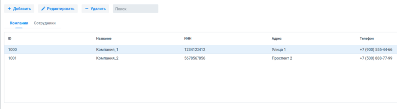
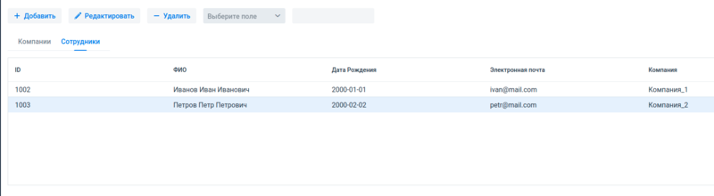
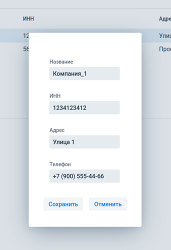
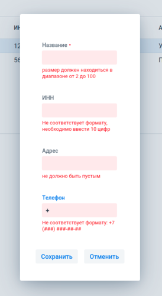
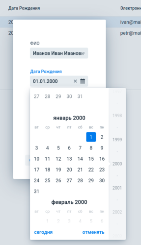
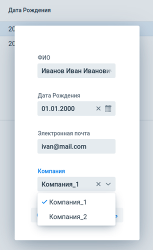
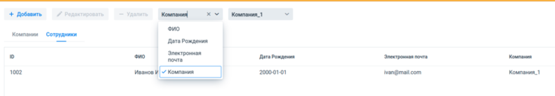
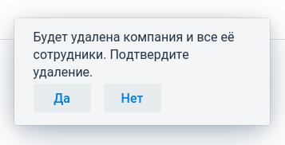

Информационная система по кампаниям и их сотрудникам
----------------------------------------------------

Ветка проекта: `JOOQ`
```shell
─── master (Spring JDBC : Spring Boot : Vaadin)
    │
    └── JOOQ (JOOQ : Spring Boot : Vaadin)
```
___

Приложение позволяет добавлять/удалять/редактировать компании и сотрудников через [веб интерфейс](src/main/java/org/infobase/web) (Vaadin 14).  
Данные отображаются в [табличном виде](src/main/java/org/infobase/web/component/grid).




Редактирование происходит в [модальном окне](src/main/java/org/infobase/web/component/dialog). Установлены диапазон допустимых значений для вводимых параметров,
маска телефонного номера, [русифицированный календарь](src/main/java/org/infobase/web/component/LocalizedDatePicker.java), в редакторе сотрудника выпадающий список компаний.  

   

Общий [поиск](src/main/java/org/infobase/web/view/SearchPanel.java) для компаний (по всем полям), для сотрудников по отдельному полю.



Всплывающие [уведомления](src/main/java/org/infobase/web/component/notification) при добавлении/удалении.



База данных Postgres, для работы с БД используется JOOQ DSLContext (
[EmployeeDaoImpl](src/main/java/org/infobase/dao/impl/EmployeeDaoImpl.java),
[CompanyDaoImpl](src/main/java/org/infobase/dao/impl/CompanyDaoImpl.java)
).

Так же используется версионирование структуры БД при помощи Liquibase ([changelog](src/main/resources/db/changelog/db.changelog-master.xml))
Обновление базы
```shell
mvn liquibase:update
```
Генерация классов на основе базы
```shell
mvn clean org.jooq:jooq-codegen-maven:3.15.2:generate -Pjooq-codegen
```
---

### Требования

- JDK 11
- Maven 3
- Docker 20

---

### Запуск

Локально
```shell
mvn spring-boot:run
```

~~В контейнере~~ **(В процессе разработки)**
```shell
mvn clean package -DskipTests -Pproduction
```
```shell
docker build -t infobase/companies-employees .
```
```shell
docker-compose up
```

URL: [http://localhost:8080/](http://localhost:8080/)

Если при запуске выводит похожие ошибки (`FATAL: database "info" does not exist`, `ERROR: relation "companies" already exists`), попробуйте:
```shell
docker-compose down --volumes
docker-compose up --build
```
